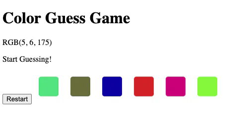
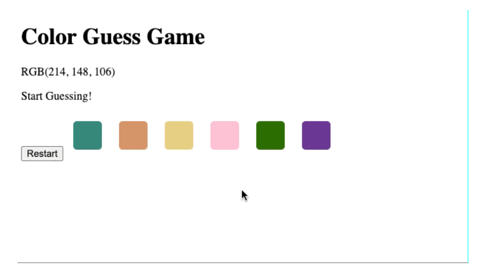
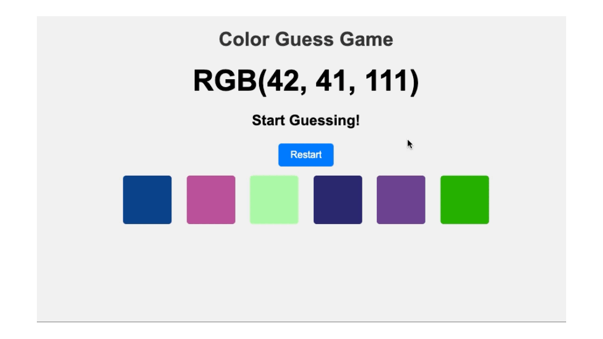

# color guess game

- [color guess game](#color-guess-game)
  - [learning](#learning)
  - [about](#about)
  - [stages](#stages)
    - [1: setting up the game screen](#1-setting-up-the-game-screen)
    - [2: shuffle the colors](#2-shuffle-the-colors)
    - [3: gameplay time](#3-gameplay-time)
    - [4: bonus stage](#4-bonus-stage)

## learning
while implementing the game, you will practice dom manipulations, generate random colors, manage user interactions, and control game flow with loops and conditions.

## about
the color guess game is a simple web-based game where players are presented with a target rgb color value displayed in text form. below the target color are several color blocks, each representing a different rgb color. players must click on the color block they believe matches the target color.

## stages
### 1: setting up the game screen 
<details>
<summary>add the html elements to set the layout of the game</summary>

#### 1.1 description
welcome, contestants, to the "color guess game"!

in this project, you'll be putting your rgb color knowledge to the test! can you decipher the mysterious rgb code and select the correct color block? the stage is set with 6 vibrant color blocks waiting for your keen eye to pick out the right one.

let's set the scene for our first stage, shall we? you'll need the following html elements to kick off this colorful game:

- an eye-catching `<h1>` element to grab your attention and set the tone for the challenge ahead.
- a mesmerizing `<p>` tag displaying the rgb color value, teasing you with its cryptic code.
- 6 dazzling `<div>` elements, each representing a different color block for you to choose from.
- and of course, a handy-dandy "restart" button to reset the game and try your luck once more!

get ready to dive into the world of hues, shades, and rgb mysteries as you take your first steps into the "color guess game"! are you up for the challenge? let the games begin!

to make the color-blocks similar to examples you can use this style for the color-block class:
```css
.color-block {
 display: inline-block;
 margin: 10px;
 border-radius: 5px;
 cursor: pointer;
 padding: 20px;
}
```

#### 1.2 objectives
in this stage, you should:

1. create an html document with the specified structure.
2. set up the title of the game as "color guess game" using an h1 element.
3. display the rgb color to be guessed using a paragraph element with the id "rgb-color". the text should be "rgb(255, 0, 0)".
4. show the initial status message "start guessing!" using a paragraph element with the id "status".
5. include a button element with the id "restart" for restarting the game.
6. create six color blocks, each represented by a div element with the class "color-block".
7. set the background color of each color block using css with the specified rgb values.
  - following this order, colors are:
    1. rgb(255, 0, 0)
    2. rgb(255, 255, 0)
    3. rgb(0, 255, 0)
    4. rgb(0, 255, 255)
    5. rgb(0, 0, 255)
    6. rgb(255, 0, 255)

#### 1.3 examples
example 1:


</details>

### 2: shuffle the colors
<details>
<summary>pick random rgb value to be guessed and shuffle the colors of color blocks</summary>

#### 2.1 description
welcome back, contestants! it's time for the color shuffle challenge!

in this stage, you'll need to channel your inner color magician and dazzle us with your javascript skills! your mission? once the page loads, randomize the rgb-color value paragraph and also shake up those color-block backgrounds. but here's the twist – one of those color-blocks must be the correct color!

get ready to paint the town red, blue, green, or any color your heart desires! are you up for the challenge, or will you be seeing shades of defeat? let the second stage begin!

#### 2.2 objectives
in this stage, once the page loads, you need to::

1. generate a random correct rgb color.
2. update the text content of the #rgb-color element to display the correct rgb color in uppercase: "rgb(0,0,0)".
3. randomize the background color of all color blocks.
4. make sure one of the color blocks matches the correct color. for example,
    random correct color: rgb(94, 47, 62)
    color blocks: rgb(3, 67, 53), rgb(119, 120, 157), rgb(63, 141, 13), rgb(201, 76, 53), rgb(80, 42, 44), rgb(94, 47, 62)
    here, the random correct color is one of the colors present in color blocks.
5. begin the game when the script is executed after page load.

#### 2.3 examples
example 1:



</details>

### 3: gameplay time
<details>
<summary>implement the gameplay by handing click events for color blocks and restart button</summary>

#### 3.1 description
are you ready, contestants? it's time for the third stage of our colorful challenge!

in this stage, the excitement reaches its peak as the player, get to interact with the color-blocks like never before. click on those vibrant hues and watch the magic unfold! if your choice is incorrect, fear not! the color-block will gracefully disappear, and our status text will say, "try again!"

but wait, there's more! make the right selection, and prepare to bask in the glory of correctness! as you choose the correct color-block, our status text will say, "correct!"

and for those moments when you need a fresh start, fear not! simply hit that restart button, and watch as the game resets itself with a whole new set of colors, ready to challenge you once again!

#### 3.2 objectives
in this stage, you should:

1. handle the click event on a color block:
  - if the clicked block's color matches the correct color, update the status message to "correct!" and optionally, set all color blocks to display the correct color.
  - if the clicked block's color does not match the correct color, update the status message to "try again!" and hide the clicked block. use `display: none` to hide the block.
2. restart the game when clicked on the restart button:
  - reset the status message to "start guessing!".
  - show all color blocks.
  - start a new game.

#### 3.3 examples
example 1:



</details>

### 4: bonus stage
<details>
<summary>spice up the game screen with some style</summary>

#### 4.1 description
welcome to the final bonus stage!

congratulations, dear players! you've made it this far, showcasing your coding prowess and creativity. now, it's time to unleash your inner designer and style the game page like never before!

in this stage, you have the power to transform the game page into a visual masterpiece. let your imagination run wild! from dazzling colors to eye-popping animations, the stage is yours to command. be bold, be daring, be you!

are you ready to level up your game and create a design that will be remembered for ages? the spotlight is on you, so go ahead and make it legendary! 

#### 4.2 objectives
bonus stage! no extra requirements

#### 4.3 examples
example 1:



</details>

[<<](https://github.com/eucarizan/front-end/blob/main/README.md)
<!--
:%s/\(Sample \(Input\|Output\) \d:\)\n\(.*\)/```\r\r**\1**\r```\3/gc
-->

